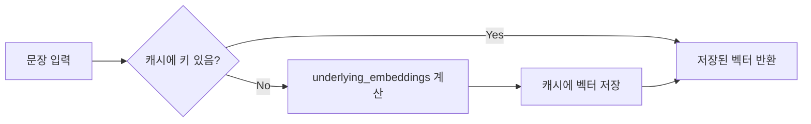

# ■ 핵심 개념 정리 — ChatGPT API · Prompt Caching · Embeddings  
> 임베디드 졸음운전 방지 프로젝트용 메모  
> (작성 2025-05-28)

---

## 1. ChatGPT API (*Chat Completions*)

| 항목 | 내용 |
|------|------|
| **엔드포인트** | `POST https://api.openai.com/v1/chat/completions` |
| **요청 본문** | `model`, `messages[]`, 선택 파라미터 (`stream`, `temperature`, `tools` 등) |
| **역할(role)** | `system → assistant ↔ user` 순으로 대화 맥락 전달 |
| **응답** | JSON → `choices[0].message.content` 에 모델 답변, `usage` 필드에 토큰 통계 |
| **과금** | *입력 토큰 × 단가* + *출력 토큰 × 단가*<br>(예: **GPT-4o mini** 기준 — 입력 $0.40 / M, 출력 $1.60 / M) |
| **지연 ↓ 방법** | ① `stream:true` 로 토큰 스트리밍<br>② Prompt Caching(아래) 활용 |

### 1-1. 최소 호출 예시 (Python SDK)

```python
from openai import OpenAI
client = OpenAI(api_key="sk-...")

resp = client.chat.completions.create(
    model="gpt-4o-mini",
    messages=[
        {"role": "system", "content": "You are an upbeat co-driver."},
        {"role": "user",   "content": "내가 졸려, 말 좀 걸어줘!"}
    ],
    stream=False           # True로 하면 토큰 단위 스트리밍
)
print(resp.choices[0].message.content)
```

---

## 2. Prompt Caching

> **같은 조직**에서 **최근 1 시간** 이내 제출된 프롬프트의 **앞 1 024 token 이상**이 일치하면 **입력 토큰 비용 50 % 할인** + 전처리 지연 감소.

| 체크포인트 | 이유 / 효과 |
|------------|-------------|
| 공통 시스템 프롬프트·예시는 **맨 앞**에 고정 | 캐시 적중률 ↑ |
| 1 024 token 이상 되도록 컨텍스트 묶기 | 캐시 임계값 충족 |
| 캐시 의도 O + `stream:true` | 실측 지연 30 %↓ |

캐시 적중 여부는 응답 JSON의  
`usage.prompt_tokens_details.cached_tokens` 필드로 확인할 수 있다.

---

## 3. Embeddings API

| 항목 | 내용 |
|------|------|
| **엔드포인트** | `POST https://api.openai.com/v1/embeddings` |
| **대표 모델** | `text-embedding-3-small` (1 536‑dim, 저가형) |
| **출력** | 입력 텍스트 → 부동소수 벡터<br>예: `[0.018, -0.012, …]` |
| **주요 용도** | • 벡터 DB(FAISS/Chroma) 검색<br>• RAG(Retrieval‑Augmented Generation)<br>• 유사도 기반 문서 요약·압축 |

### 3-1. 간단 호출 예

```python
vec = client.embeddings.create(
    model="text-embedding-3-small",
    input="졸음운전 방지 프로젝트 개요"
).data[0].embedding   # 길이 1 536
```

### 3-2. 긴 텍스트 요약 워크플로

1. GPT가 반환한 **긴 답변** → 문단 단위 **벡터화** 후 로컬 DB 저장  
2. “핵심 정보만” 요청 시, **질의 벡터**와 **CosSim Top‑k** 문단 검색  
3. 추출 문단만 GPT에게 보내 **재요약** → 출력 토큰·지연 ↓

---

## 4. 용어 한눈에 보기

| 용어 | 정의 |
|------|------|
| **API** | 기능을 외부에 노출하는 **계약(명세)** |
| **엔드포인트** | “주소 + HTTP 메서드” 한 쌍으로 정의된 API 호출 지점 |
| **토큰** | LLM이 처리하는 최소 단위 (영어 ≈ 0.75 단어, 한글 ≈ 1 글자) |
| **Prompt Caching** | 동일 프롬프트 prefix 재사용 시 입력 토큰 50 % 할인 |
| **Embedding** | 텍스트 의미를 보존하는 고차원 벡터 표현 |


# ■ CacheBackedEmbeddings 정리
> 임베디드 졸음운전 방지 프로젝트 — 벡터 캐싱 전략  
> (작성 2025‑05‑28)

---

## 0. 왜 ‘임베딩 캐시’가 필요할까? 🧐
- **임베딩(Embedding)** : 문장·문서를 숫자 벡터로 변환한 결과  
- 한 번 계산할 때마다 **시간(수 백 ms)** · **토큰 비용** 발생  
- **같은 텍스트**를 반복 임베딩할 경우, _이전 결과_를 저장해 두면 **속도 ↑ / 비용 0**  

---

## 1. CacheBackedEmbeddings 한눈에 보기
| 구성 요소 | 설명 |
|-----------|------|
| **underlying_embeddings** | 실제 벡터를 계산하는 엔진 (예: `OpenAIEmbeddings`) |
| **ByteStore** | `(키, 벡터)`를 저장하는 캐시 — 로컬파일, 메모리, Redis… |
| **namespace** | “임베딩 모델 이름” 같은 구분자<br>→ **같은 문장**을 다른 모델로 임베딩해도 **키 충돌** 방지 |
| **동작 로직** | 1️⃣ 문장을 해시 → 키 생성<br>2️⃣ 캐시에 키 존재? → HIT라면 저장된 벡터 반환<br>3️⃣ MISS라면 엔진으로 계산 → 캐시에 저장 후 반환 |



---

## 2. 저장소(ByteStore) 선택
| ByteStore | 지속성 | 사용 예 |
|-----------|--------|---------|
| `LocalFileStore("./cache/")` | 영구 (디스크) | 프로덕션·노트북 실험 결과 재사용 |
| `InMemoryByteStore()` | 휘발성 (RAM) | 단위 테스트·임시 스크립트 |
| Redis / S3 등 | 네트워크 | 다중 서버·분산 환경 |

---

## 3. 로컬 파일 캐시 예제

```python
from langchain.storage import LocalFileStore
from langchain_openai import OpenAIEmbeddings
from langchain.embeddings import CacheBackedEmbeddings

# ① 기본 임베딩 엔진
embedding = OpenAIEmbeddings()                # ex. text-embedding-ada-002

# ② 파일 기반 캐시
store = LocalFileStore("./cache/")

# ③ 캐시 래퍼 생성
cached_embedder = CacheBackedEmbeddings.from_bytes_store(
    underlying_embeddings=embedding,
    document_embedding_cache=store,
    namespace=embedding.model
)

# 첫 호출 → API 계산 & 저장
vec1 = cached_embedder.embed_query("졸음운전 방지 시스템")

# 두번째 호출 → 파일 캐시 HIT (수 ms)
vec2 = cached_embedder.embed_query("졸음운전 방지 시스템")
```

---

## 4. 메모리 캐시 예제

```python
from langchain.storage import InMemoryByteStore
cached_embedder = CacheBackedEmbeddings.from_bytes_store(
    embedding, InMemoryByteStore(), namespace=embedding.model
)
```
> 🚧 프로세스 종료 시 캐시 삭제 — 테스트용으로 적합.

---

## 5. 캐시 효과 체감 💡
| 호출 | 처리 시간 | 비용 |
|------|-----------|------|
| **1 회차** | 300–500 ms (API) | 정상 토큰 과금 |
| **2 회차** | **1–5 ms** (캐시 HIT) | 0 |

---

## 6. ChatGPT API에 적용하기
- 개념 자체는 **“같은 입력이면 같은 출력 사용”** → 가능  
- 구현 방식  
  1. 전체 프롬프트를 SHA‑256 해시 → SQLite/Redis 캐시  
  2. 키 존재 시 API 호출 생략, 저장된 JSON 답변 반환  
- **주의**  
  - GPT 답변은 확률적 → `temperature=0` 같이 결정적 세팅이 아니면 내용이 달라질 수 있음  
  - 버전·시스템 프롬프트가 바뀌면 캐시 무효화 필요  

---

## 7. CacheBackedEmbeddings vs Cache vs Embedding
| 항목 | 정의 | 비고 |
|------|------|------|
| **Embedding** | 문장 → 벡터 **결과물** | 계산 시 비용·시간 발생 |
| **Cache** | **이미 계산한 값**을 저장하는 **보관함** | 내용물은 아무 타입이나 가능 |
| **CacheBackedEmbeddings** | “Embedding + Cache”를 묶은 **전용 래퍼** | 해시·네임스페이스·저장포맷까지 규격화 |

> 한 줄 요약 : **CacheBackedEmbeddings = “임베딩 전용 캐시 관리자”**  
> → 반복 임베딩 작업에서 **속도 ↑ / 비용 ↓ / 코드 간소화**!

---

# ■ 짧은 응답 제어 전략 — “200자 이내” 설정하기
> 임베디드 졸음운전 방지 프로젝트 — ChatGPT 응답 길이 관리  
> (작성 2025‑05‑28)

---

## 1. 시스템·유저 프롬프트로 길이 제한하기
```jsonc
{
  "model": "gpt-4o-mini",
  "messages": [
    {"role": "system",
     "content": "당신은 졸음운전 방지용 보조 AI입니다. 한국어로, 200자 이내로만 대답하세요."},
    {"role": "user",
     "content": "내가 졸려. 짧게 얘기 좀 해 줘!"}
  ]
}
```
- **시스템 프롬프트**에 길이 규칙을 명시 → 모델이 가장 우선시함  
- 필요하면 유저 프롬프트에도 한 번 더 “두 문장이면 충분해” 등으로 강조

---

## 2. `max_tokens` 로 물리적 컷오프
```jsonc
{
  "...",
  "max_tokens": 120   // 한글 1자 ≈ 1토큰 → 대략 120자 내외
}
```
- 토큰 기준 상한선을 걸어 지나치게 긴 응답 차단  
- `temperature`가 높아도 출력 길이가 물리적으로 제한됨

---

## 3. 캐시·임베딩 필요성 재평가
| 목적 | 프롬프트 길이 제한으로 해결? | 캐시 / 임베딩 필요성 |
|------|------------------------------|----------------------|
| **출력 토큰·비용 절감** | ✅ | 📉 |
| **반복 호출 지연 절감** | ❌ | ✅ (캐시 Hit 시 0 ms) |
| **대용량 문서 요약** | ❌ | ✅ (임베딩 + 요약) |
| **FAQ 동일 질문 재사용** | ⏯ | ⬆ 캐시 효과 큼 |

> 요약: **짧은 답변만** 필요하고 **반복 호출이 적다면** 캐시·임베딩 없이도 충분.  
> 그러나 **지연·반복 비용** 또는 **문서 요약**이 필요한 경우 캐시·임베딩은 여전히 유용.

---

## 4. 실전 설정 팁
1. **시스템 프롬프트**: “ 무조건 200자 이내·두 문장 이하·핵심만 ”  
2. **`max_tokens`**: 120 ~ 150 token 권장  
3. **사전 토큰 계산**: `tiktoken`으로 예상 길이 확인 후 조정  
4. **`temperature`**: 0.2 ~ 0.5 → 더 간결하고 예측 가능한 문장

---

> 추가로 **지연**까지 줄이고 싶다면 `stream:true` 옵션을 병행하여 토큰이 생성되는 즉시 TTS로 흘려보내면 체감 반응 속도를 더 줄일 수 있습니다.

